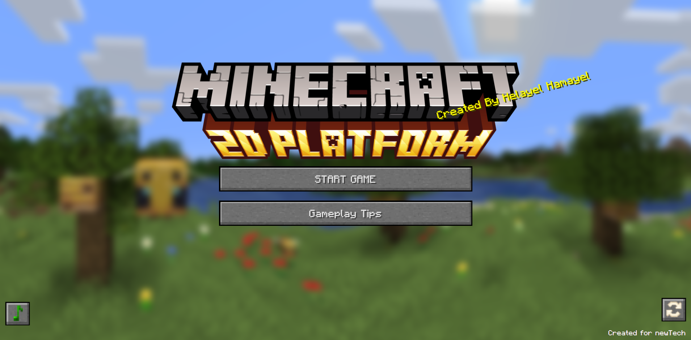
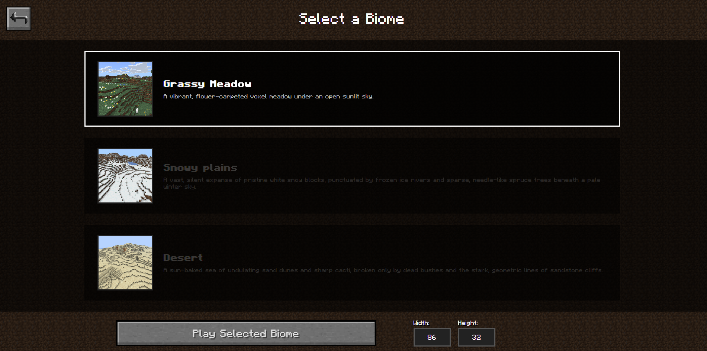
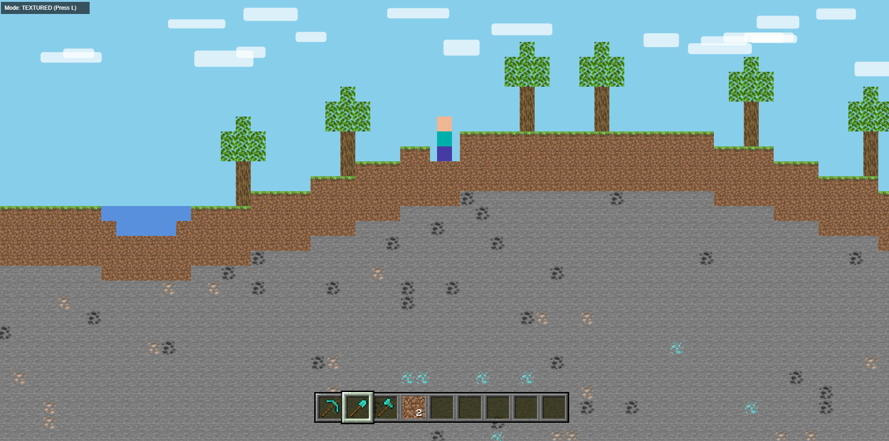

# Minecraft 2D Platformer

A lightweight, browser-based 2D recreation of Minecraft built from scratch using HTML5 Canvas, CSS, and vanilla JavaScript. This project translates the core mechanics of the classic open-world voxel game into a scrolling 2D platformer environment.

---

## 🚀 Key Features

* **Procedural World Generation:** Generates a dynamic 2D sandbox world on the fly using smooth sine-wave math curves. It handles everything from surface terrain and a dedicated water basin to deep underground stone layers packed with random ore veins (Coal, Iron, and Diamonds), topped off with procedurally grown Oak trees.
* **Smart Performance Rendering:** Keeps the game running butter-smooth by culling anything outside your active viewport so the engine doesn't waste resources rendering invisible blocks. If performance ever dips, hitting the `L` key instantly swaps out the heavy PNG textures for fast, flat-color hex boxes.
* **Strict Mining Reach:** Keeps gameplay fair by enforcing a maximum reach limit. Using clean coordinate math, the game calculates the exact pixel distance between the player's center and the target block—if you're further than 3.5 blocks ($112\text{px}$) away, you can't touch it.
* **Smart Hotbar & Tool Matching:** Features a fully functional 9-slot hotbar that keeps track of active items, stack sizes, and tools. To keep things realistic, the world enforces a matching tool rule: you'll need a Pickaxe for stone/ores, a Shovel for dirt, and an Axe for logs. Using the wrong tool significantly slows down your mining speed.
* **Visual Block Breaking Progress:** Simulates realistic block damage when mining. Holding down Left Click progresses the block through three distinct physical cracking overlays ($>15\%$, $>45\%$, and $>75\%$). If you let go of the mouse early, the fatigue resets instantly.
* **Platformer Physics & Drop-Through Mechanics:** Runs on precise gravity and collision loops ($V_x = 3$, Gravity = $0.3$, Jump Force = $-9$) to make jumping and moving feel solid. It also supports semi-solid platforms like Leaves and Wood, meaning you can walk right over them or hold the down-crouch key (`S`) to drop straight through.
* **Interactive Audio Track Selector:** Includes a live-switching soundtrack manager loaded with classic tracks like `Sweden` and `Alpha`. Players can click through the custom soundboard UI to swap audio streams or mute the game instantly without breaking the gameplay loop.

---

## 📸 Visual Demonstration

### Main Title Screen
The game kicks off with a classic title dashboard. Before jumping into the world, you can use the interface options to set your custom map size (height and width) and pick your starting biome to customize how the terrain generates.

### Custom Setup & Biome Selection
Choose your generation biome and set custom map constraints directly from the customized bottom interface panel:

### Gameplay & Mining Mechanics
Mine and build elements safely inside a precision-calculated interaction boundary centered around the player asset:

---

## 🎮 Controls

| Action / Shortcut | Input Source | Technical System Behavior |
| :--- | :--- |
| **Move Left / Right** | `A` / `D` or `Left` / `Right Arrow` | 
| **Jump** | `Spacebar` / `W` / `Up Arrow` | 
| **Crouch / Drop-Through** | `S` / `Down Arrow` |
| **Mine Voxel Element** | `Left Click` | 
| **Place Selected Item** | `Right Click` | 
| **Hotbar Selection** | Keys `1` through `9` | 
| **Solid/Texture Toggle** | `L` Key | 
| **Pause Game Menu** | `Escape` | 

---